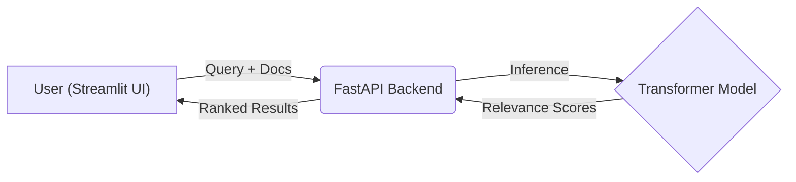

# 🔍 Semantic Reranker Microservice

> **"Search is not just about matching keywords; it is about understanding intent."**

## 🚀 Overview
This project is a **Semantic Reranking Engine** designed to improve the relevance of Information Retrieval (IR) systems. It takes a user query and a list of potential documents, then uses a Deep Learning model (Cross-Encoder) to re-order the documents based on semantic similarity.

This mimics the architecture that is used in modern **RAG (Retrieval-Augmented Generation)** pipelines to ensure LLMs receive only the most relevant context.

## 🏗️ Architecture
The application follows a microservices pattern, fully containerized with Docker.

